## :computer:ICV TIME SERIES PREDICTION UNSING MACHINE LEARNING:green_book:  

## :scroll:Short results description

:green_book: The objective of this doccument is to predict the ICV timeseries using Machine Learning. To do this, 3 regression models were trained with data in *three-month frequency*, adittionally, the model performance were calculated using the **Mean Absolute Error**, which indicates **in average, how much the model predictions differ from real ones**

:green_book: Following, is shown the table with results.

**Table 1**

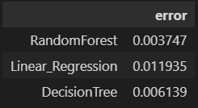

:green_book: From the previous table, can be concluded that the model with best performance is **RandomForest()**, because it has the least error value. 

## :minidisc: Data Exploration :minidisc:

#### :scroll:Resampling and icv timeseries reading

Initially, can be seen that the ICV timeseries is not in the same frequency as the predictor variables (**located in ‘variables_macro_trimestral.xlsx’**), because the ICV is in monthly and predictors are in quarterly frequencies. 

In base of the previous description, it’s necessary to answer **which of the two databases modify?** because the most convenient is that both timeseries have the same time frequency :hourglass:. In this case ICV timeseries will be converted from monthly to quarterly frequency. 

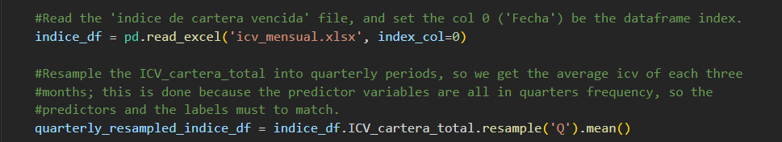

**Figure 1** Information about the ICV is saved into **indice_df** and then the resampling to quarterly is done, after is saved into the dataframe **quarterly_resampled_indice_df**

**NOTE:exclamation::** Initially, we will train the models with quarterly data, then, we will show how to project/predict the icv data yearly. 

#### :book: Reading variables (Predictors)

:green_book: Following we read the predictors, and first we drop the first 3 rows and the last one so they match with the labels (icv)

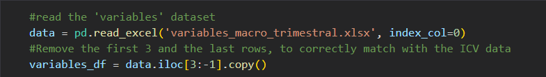

**Figure 2**

:green_book: Then we concat the predictors and labels into a single dataframe, and we add an incremental numerical column so it represents the numerical period.

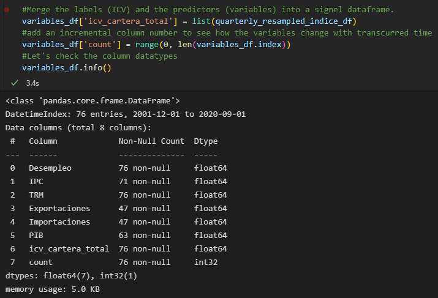

**Figure 3**

:green_book: From figure 3 we infer that there are 4 columns with null values which must be imputed

#### :bar_chart:Correlation between variables:chart_with_upwards_trend:

:green_book: We generated the following plot so we see the correlations between variables, icv included 

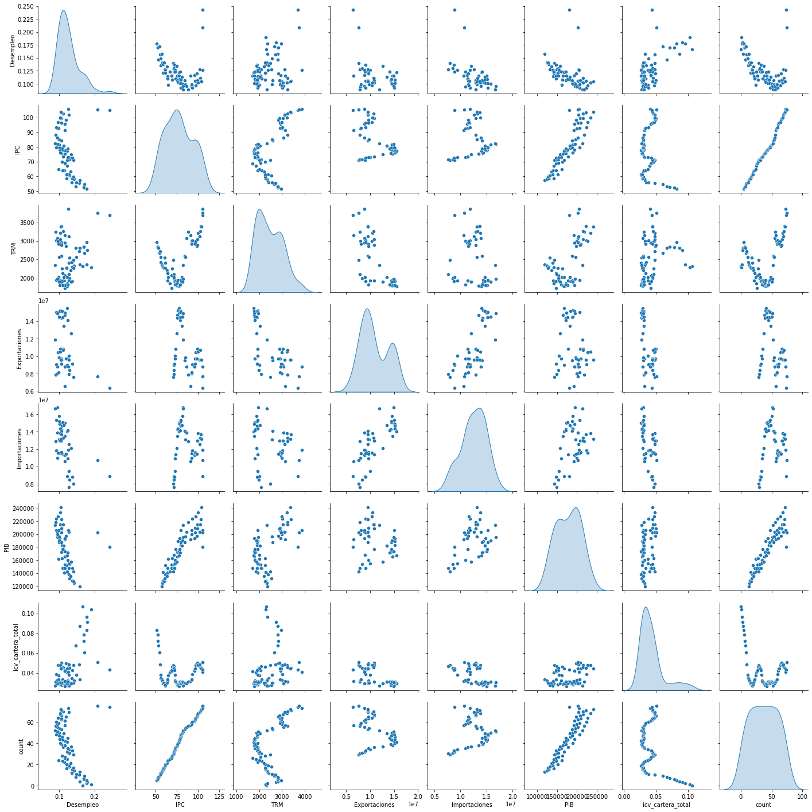

**Figura 4** 

:green_book: We see **icv** has a positive correlation with **Desempleo** variable, :bangbang: **but the correlation of icv with the remaining variables isn’t so strong** :bangbang:

## :memo:Imputation using Linear Regression:fountain_pen:

:green_book: Also from figure 4 we see variables**PIB** and **IPC** have a strong correlation with time (the more time the higher the values), for this reason we chose to use Linear Regression to impute the null values, to do this, we developed the function **regression_imputer()** which makes the imputation automatically.

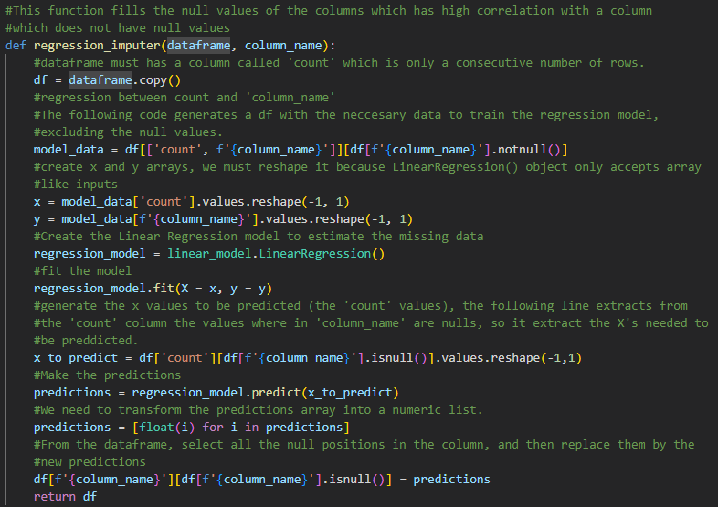

**Figure 5**

:green_book: Figure 6 shows how to use the **regression_imputer()** function

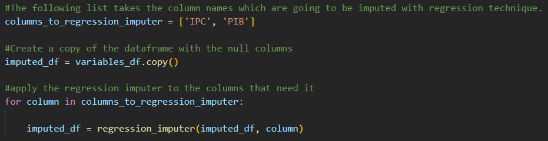

**Figure 6** 

## :pencil2:Training 'entrenamiento' & Test 'testeo' Data Split:scroll:

:arrow_right:Following we save in **x** the predictors matrix and in **y** the labels vector (icv), and from these two data arranges, we create the splits **’entrenamiento’** for model training and **testeo** for model testing, using sklearn function **train_test_split()**.

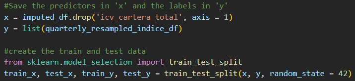

**Figure 7** 

:arrow_right:To impute the remaining columns with null values, we used the **SimpleImputer()** function

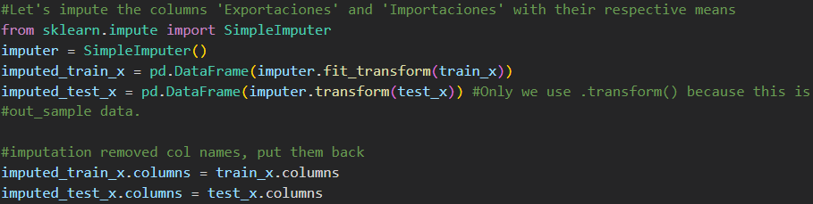

**Figura 8**

## :brain:Training and Model Evaluation:robot:

:arrow_right:We decided to use three models:

    :bulb:RandomForestRegressor()

    :bulb:LinearRegression()

    :bulb:DecisionTreeRegressor()

:arrow_right: We used mean absolute error to calculate the error of every model. Following we show a for loop which trains and tests the models, and then generates a table with the results. 

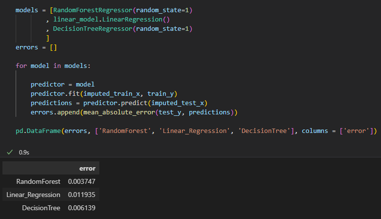

**Figure 9**

## :notebook:LINEAR REGRESSION MODEL COEFFICIENTS INTERPRETATION:mag_right:

:arrow_right: Linear regression models provide important information and interpretations from the problem we are modelling, because the values of it’s coefficients indicate the weight each variable has in the final prediction of the model, so the greater the coefficient, the more important it is. Following we show the Linear Regressor construction and the values of its coefficients. 

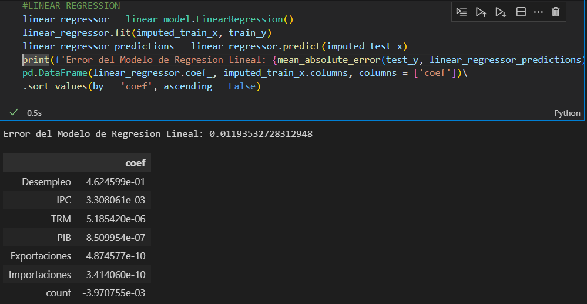

**Linear Regression Figure**

:arrow_right:De la figura anterior, se puede inferir que la variable que más influencia tiene a la hora de predecir el icv es **Desempleo**; inclusive, desde un punto de vista simplificado, se podría decir que **es la única variable que tiene un impacto considerable a la hora de predecir el icv**, ya que su coeficiente es **varios ordenes de magnitud** mayor que los coeficientes de las demás variables. 

## Valor proyectado del icv a un año :chart_with_downwards_trend:

**NOTA:exclamation::** El código para la predicción del icv se encuentra en el archivo **icv_anual.ipynb** 

:arrow_right:Para realizar la predicción del icv a uno año, se debe realizar un 'resampling' similar al realizado previamente, pero esta vez no trimestral sino anual; adicionalmente este cambio de frecuencia temporal se debe realizar sobre las dos series de tiempo 'icv' y 'variables'. 

:arrow_right:El procedimiento de predicciones anuales no contiene nada diferente al procedimiento de predicciones trimestrales, la decisión de haber mostrado el procedimiento de desarrollo de modelos para frecuencias trimestrales es porque **con frecuencias trimestrales disponemos de más datos y por ello los modelos alcanzan mejores desempeños**. 

:arrow_right:Para la predicción anual se eligió el modelo **RandomForestRegressor()** porque éste fue el que mejor desempeño tuvo en las predicciones trimestrales; el error encontrado en las predicciones anuales fue **0.022005**, valor mayor al error trimestral, **puesto que se disponen de menos datos para entrenar el modelo**. La construcción del modelo se enseña a continuación. 

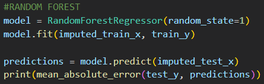

**Figura 10**

:green_book:Para realizar la prediccion del icv anual del 2021, se utilizó el siguiente fragmento de código, y el resultado de esta predicción fue de **0.04638 = 4.638%**

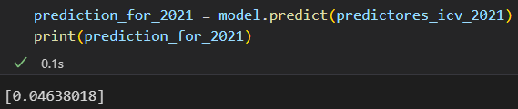

**Figura 11**

:green_book:Contrastando el valor predicho del icv con los valores reales, se encuentra poca diferencia, hecho que aumenta la credibilidad de los modelos acá entrenados; el artículo de **la república**, titulado **Estos son los bancos con mayores y menores índices de cartera vencida a julio de 2021** indica que para Julio del 2021 se tenía para Bancolombia un icv de 4,6%, valor similar al predicho por el modelo; pese a que sólo se tiene el valor de los primero 6 meses del icv para el 2021, es un estimativo significativo sobre la efectividad del modelo acá desarrollado. 

**NOTA:exclamation:: la fuente del artículo de la república, se encuentra en el archivo de texto plano adjunto al proyecto**

### :books:Variables adicionales en la predicción del icv:label:

:green_book:A la hora de considerar otras variables con capacidad predictiva para el icv, habrá que tener en cuenta que el icv es una **serie de tiempo** y por ende, se puede aprovechar la **teoría de modelación de series de tiempo** **(:bangbang: ARIMA & SARIMA :bangbang:)**, la cual emplea fuertemente los valores pasados o históricos de la serie de tiempo para predecir los futuros valores. por ejemplo, unas de las herramientas más usadas en series de tiempo son **medias móviles simples** y también **medias móviles exponenciales**.

:green_book:Por lo anterior, yo recomendaría inferir nuevas variables a partir de los valores pasados del icv, variables como: 

:herb: media móvil simple

:herb: media móvil exponencial

:herb: indice anterior

:herb: desviación estandard de la serie de tiempo 'n' periodos atrás

:maple_leaf:**Se pueden inferir ilimitados posibles predictores en base a los mismos datos históricos**, un ejemplo de uso extensivo de la teoría de predicción de series de tiempo son los modelos de trading financiero, los cuales analizan series de precios y deciden en base a ello tomar alguna decisión en el mercado. 

